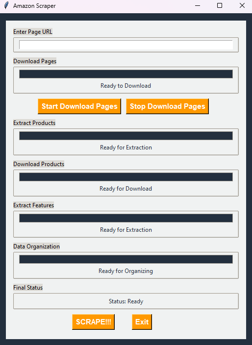
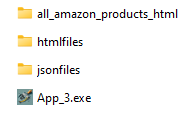
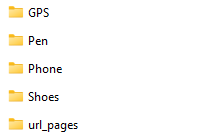
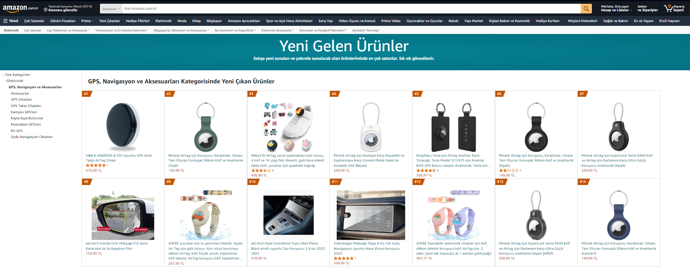
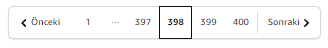

# Amazon Scraper

<div style="text-align: center;">  </div>
Bu uygulama, **Amazon** üzerindeki ürünlerin verilerini çekmek ve analiz etmek için geliştirilmiştir. Uygulamanın amacı eğitim amaçlıdır ve ticari bir kullanım hedeflemez. Toplanan veriler, veri analizi ve yapay zeka modelleri geliştirmek için kullanılabilir.

---

## 🔧 Uygulamanın Kurulumu ve Çalıştırılması  

### **İndir ve Klasör Yapısını Kontrol Et**  
- **İlk adım:** Uygulamanın `.exe` dosyasını bilgisayarınıza indirin.  
- **Klasör yapısını kontrol edin:** Uygulama, çalışırken aşağıdaki klasörlerin var olmasını bekler. Eğer yoksa, bu klasörleri manuel olarak oluşturabilir veya uygulama açıldığında otomatik oluşturmasını bekleyebilirsiniz:

  ```plaintext
  /htmlfiles                 -> HTML dosyalarının kaydedileceği klasör  
  /jsonfiles                 -> JSON çıktılarının saklanacağı klasör  
  /all_amazon_products_html  -> Ürün sayfalarının saklanacağı klasör
  
## 🚀 Uygulamanın Kullanımı

### **Uygulamayı Başlatın**:
- **Adım 1:** `.exe`  dosyasına çift tıklayın. 
- **Adım 2:**  Uygulama açıldığında, grafik kullanıcı arayüzü (GUI) ile karşılaşacaksınız:
   
  - **Arayüz Açıklamaları:**
    - **Enter Page URL:**  Amazon sayfasının URL’sini bu alana yapıştırın.
    - **Start Download Pages:** Girdiğiniz URL’den itibaren sayfaları otomatik indirmeyi başlatır.
    - **Stop Download Pages:** Sayfa indirme işlemini durdurur.
    - **SCRAPE!!!** İndirilen sayfalardan ürün bilgilerini ve özelliklerini çıkarır. 
    - **Exit:** Uygulamayı kapatır.
    - **Final Status:** İşlemin durumunu ve sonucunu gösterir.


## 📂 Klasör Yapısı ve Dosya Yönetimi

- **Klasör Yapısı**: 
   - `htmlfiles`: Sayfaların HTML çıktılarının saklanacağı ana klasör.
   - `url_pages`: URL ile indirilen sayfaların otomatik olarak kaydedildiği klasör.
   - **Öneri:** İndirdiğiniz sayfaları kategoriye göre alt klasörlere ayırmanız önerilir:
  

  
## ⚠️ Sayfa İndirirken Dikkat Edilmesi Gerekenler
1. **Otomatik İndirme Sorunları:**
   - Otomatik indirme sırasında bazı sayfalar eksik veya hatalı yüklenebilir. Bu durumda, sayfaları manuel olarak indirmeniz önerilir:
   

   
2. **Doğru URL Kullanımı:**
   - Verdiğiniz URL, sayfa geçişlerine uygun olmalıdır. Örneğin, bir kategori sayfasına ait olmalıdır:
   


3. **Sayfa Sayısı Yönetimi:** 
   - Belirli sayıda sayfa indirmek istiyorsanız, "Stop Download Pages" butonunu kullanarak işlemi durdurabilirsiniz.
   - Alternatif olarak, `url_pages` klasörüne giderek gereksiz sayfaları manuel olarak silebilirsiniz.

## 📊 Çıktı ve Sonuçların Kontrolü
İşlemler tamamlandığında, jsonfiles klasöründe aşağıdaki dosyaları bulabilirsiniz:
        
    ```plaintext
    /jsonfiles  
    ├── amazon_products.json         -> Tüm ürünlerin temel bilgilerini içerir  
    ├── extracted_product_data.json  -> Ürünlerin detaylı özelliklerini içerir  
    └── merged_products.json         -> Düzenlenmiş ve birleştirilmiş verileri içerir
- Her bir ürünün HTML sayfası, `all_amazon_products_html` klasörüne kaydedilir.
- **Depolama alanı sınırlıysa:** İhtiyacınız olmayan ürün sayfalarını bu klasörden manuel olarak silebilirsiniz.

## 🔍 Önemli Noktalar ve Hata Yönetimi

- **Hata Durumunda:** Uygulama, herhangi bir hata durumunda kullanıcıyı bilgilendirecek şekilde tasarlanmıştır. Eğer bir hata ile karşılaşırsanız, hata mesajını dikkatlice okuyun ve gerekli düzeltmeleri yapın.
- **Veri Tutarlılığı:** Uygulama ile ilgili daha fazla bilgi veya yardım isterseniz, github, linkedin veya e-mail üzerinden iletişime geçbilirsiniz.

## 🛠️ Destek ve İletişim
Uygulama ile ilgili yardım veya sorularınız için aşağıdaki platformlardan iletişime geçebilirsiniz:
- [GitHub](https://github.com/TheDenizhan)
- [LinkedIn](https://www.linkedin.com/in/hasan-denizhan-61409b208/)
- [E-posta](mailto:thedenizhan@hotmail.com)

## 📄 Lisans
Bu proje [MIT Lisansı](LICENSE) altında lisanslanmıştır.